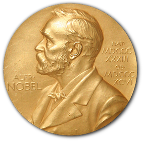

The Nobel Prize has been among the most prestigious international awards since 1901. Each year, awards are bestowed in chemistry, literature, physics, physiology or medicine, economics, and peace. In addition to the honor, prestige, and substantial prize money, the recipient also gets a gold medal with an image of Alfred Nobel (1833 - 1896), who established the prize.

The Nobel Foundation has made a dataset available of all prize winners from the outset of the awards from 1901 to 2023. The dataset used in this project is from the Nobel Prize API and is available in the `nobel.csv` file in the `data` folder.

In this project, you'll get a chance to explore and answer several questions related to this prizewinning data. And we encourage you then to explore further questions that you're interested in!

## Plot 1: Nobel Prize Winners from the United States by Decade**

**This plot illustrates the proportion of Nobel Prize winners from the `United States` over time, grouped by decade. The x-axis represents different decades, starting from `1900` to `2020`, and the y-axis shows the proportion of Nobel Prize winners (US_winners) in that particular decade. The plot indicates an upward trend in the proportion of US winners from `1900 to 2000`, highlighting the growing prominence of American laureates in various fields over the century.**

## Plot 2: Proportion of Female Nobel Prize Winners by Decade and Category

**This series of plots presents the proportion of `female` Nobel Prize winners for each decade in different categories, such as `Chemistry, Literature, Medicine, Peace, Physics, and Economics`. Each subplot focuses on a specific category, with the x-axis showing decades from 1900 to 2025 and the y-axis indicating the proportion of female winners (fems). This visualization provides insights into gender representation over time, revealing trends in female recognition across different disciplines.**

## Plot 3: Distribution of Nobel Prizes by Category and Gender

**This bar plot depicts the distribution of Nobel Prizes across different categories, broken down by gender. The x-axis lists the Nobel Prize categories `(Chemistry, Literature, Medicine, Peace, Physics, Economics)`, and the y-axis represents the count of laureates. The plot uses color to distinguish between male and female laureates, highlighting the gender disparity in Nobel Prize awards across various fields. This visualization makes it easy to identify categories with a higher representation of female winners and those predominantly won by males.**

## Plot 4: KDE Plot for Age of Nobel Prize Winners

**This KDE (Kernel Density Estimate) plot shows the cumulative distribution of Nobel Prize winners' ages, separated by gender (male and female). The x-axis represents the age of the winners, while the y-axis indicates the cumulative density of prizes. The plot provides insights into the typical age range of Nobel Prize winners and highlights any differences in age distribution between male and female laureates. The cumulative nature of the plot allows for easier comparison of the age distribution trends.**

## Plot 5: Histogram of Nobel Prize Winners by Age

**This histogram displays the distribution of `ages` of Nobel Prize winners, categorized by `gender`. The x-axis represents the age of the winners, while the y-axis shows the count of winners. Different hues represent `male` and `female` winners. This visualization helps to understand the most common age groups for Nobel Prize recipients and reveals any gender differences in the age distribution.**

## Plot 6: Horizontal Bar Plot of Nobel Prize Wins per Country

**This horizontal bar plot depicts the top `10` countries with the highest number of Nobel Prize winners based on their birth countries. The x-axis shows the count of prizes, while the y-axis lists the countries. Each bar's length represents the number of Nobel Prize laureates born in that `country`, giving a clear picture of which countries have the most Nobel laureates. This visualization highlights countries with significant contributions to fields recognized by the Nobel Prize.**